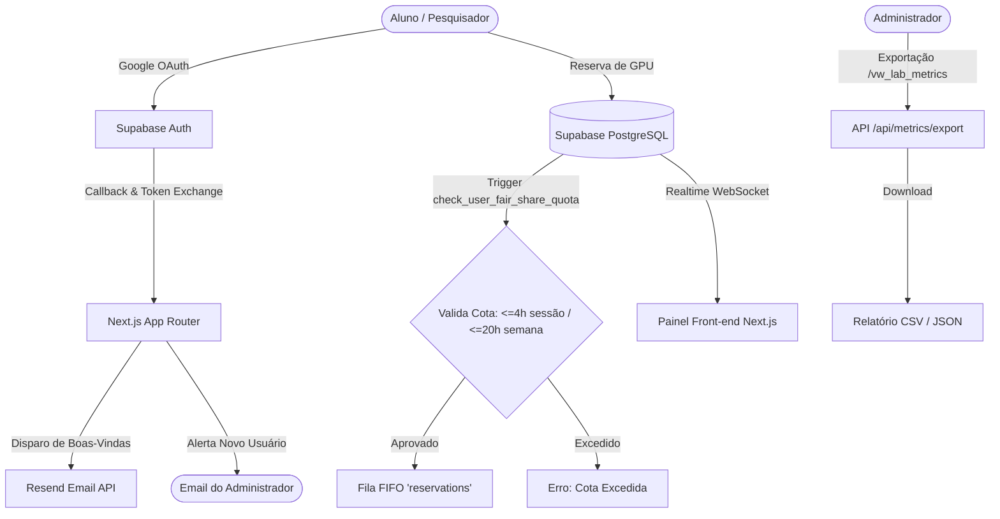

# GEOCE LabLicence — Sistema de Alocação de Hardware e Cotas Fair Sharing


O **GEOCE LabManage** é uma plataforma fullstack moderna desenvolvida para otimizar o compartilhamento de recursos computacionais (GPUs RTX 3060, RTX2060 SUPER e clusters) do **Laboratório GEOCE / UFC**.

O sistema elimina conflitos de agendamento por meio de uma fila **FIFO (First-In, First-Out)** estrita e implementa políticas automatizadas de **Fair Sharing**, garantindo que todos os alunos e pesquisadores tenham acesso igualitário e previsível ao hardware.

---

## 🚀 Principais Funcionalidades

- **Catálogo de Hardware em Tempo Real**: Visualize o status dos nós (`Disponível`, `Em Uso`, `Manutenção`, `Offline`) com dados reativos via WebSockets do Supabase.
- **Fila FIFO Inteligente**: Alocação de jobs por ordem de requisição (`requested_at`).
- **Política de Fair Sharing Automática**:
  - Limite de até **4 horas contínuas** por sessão.
  - Cota padrão de **20 horas semanais** por usuário.
  - Validação garantida no nível de banco de dados via **PostgreSQL Trigger** (`trg_validate_quota`).
- **Autenticação Institucional Google OAuth**: Login social com sincronização de perfil no primeiro acesso.
- **Pipeline de Notificações Duplas**: Envio automático de e-mail de boas-vindas ao aluno e alerta de auditoria ao administrador via **Resend**.
- **Painel Administrativo & Métricas**:
  - Gestão de status de máquinas e alteração de cotas de usuários.
  - Exportação direta de métricas de uso em formatos **CSV** e **JSON**.

---

## 🏛️ Arquitetura do Sistema



---

## 📂 Estrutura do Repositório

```
GEOCELabLicence/
├── .github/                         # Workflows de CI e templates de issues/PRs
│   ├── workflows/ci.yml
│   ├── ISSUE_TEMPLATE/
│   └── pull_request_template.md
├── antigravity.yaml                 # Manifesto de orquestração do projeto
├── vercel.json                      # Configuração de headers e deploy na Vercel
├── .env.example                     # Modelo de variáveis de ambiente
├── package.json                     # Scripts e dependências
├── tsconfig.json                    # Configurações TypeScript
├── tailwind.config.ts               # Design System com paleta laboratorial
├── supabase/
│   └── schema.sql                   # Esquema DDL completo, Triggers, Views e RLS
├── src/
│   ├── app/
│   │   ├── (auth)/                  # Login Google OAuth e rota de callback
│   │   ├── (dashboard)/             # Catálogo, Fila FIFO, Reserva e Painel Adm
│   │   ├── api/                     # Endpoints de exportação de métricas e cancelamento
│   │   ├── globals.css              # Estilos globais
│   │   └── layout.tsx               # Root layout
│   ├── components/                  # MachineCard, QuotaTracker, RealtimeQueueList
│   ├── hooks/                       # useRealtimeQueue, useUserQuota
│   ├── lib/                         # Clientes Supabase (SSR/Browser) e Resend
│   └── types/                       # Tipagem TypeScript do banco de dados
├── PASSO_A_PASSO_INSTALACAO.md      # Guia completo para instalação e configuração
└── README.md
```

---

## 🛠️ Guia Rápido de Instalação

Consulte o documento completo com instruções passo a passo detalhadas para Windows:
👉 **[PASSO_A_PASSO_INSTALACAO.md](./PASSO_A_PASSO_INSTALACAO.md)**

### Resumo dos Comandos:
```bash
# 1. Instalar dependências
pnpm install

# 2. Configurar variáveis de ambiente
cp .env.example .env.local

# 3. Rodar em ambiente de desenvolvimento
pnpm dev
```

Acesse em: `http://localhost:3000`

---

## 📄 Licença

Este projeto está sob a licença [MIT](./LICENSE) — desenvolvido para o **Laboratório GEOCE** da Universidade Federal do Ceará (UFC).
